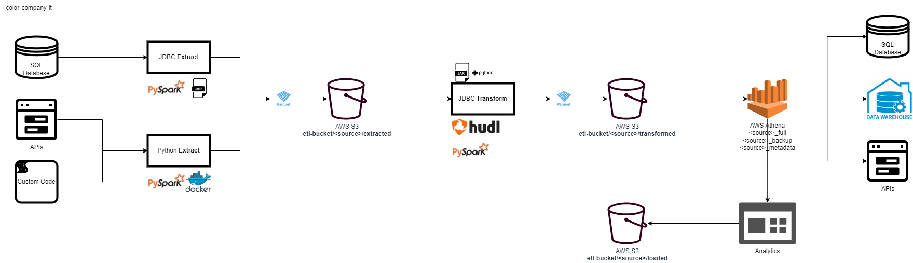

# Welcome to the Modern Cloud Datalake V1!

This particular repository represents a proof of concept (POC) for a polylithic enterprise data lake in AWS, which is a
cloud-based platform that offers a range of tools and services for data storage and analysis. The POC is designed to
demonstrate how a data lake can serve as a platform for startups and enterprises, providing a single source of truth for
data and enabling users to easily access and analyze data from various sources.

The benefits of a modern data lake design include improved data accessibility and flexibility, the ability to easily
integrate data from various sources, and the ability to store and analyze large amounts of data at scale. This can help
organizations gain a better understanding of their data and make more informed decisions, leading to improved efficiency
and effectiveness. Overall, modern data lake designs are an important tool for organizations looking to extract value
from their data and drive business growth.

# Index

1. .
	- [1_configuration](./1_configuration.md)
	- [2_codebase](./2_codebase.md)
	- [3_jdbc_etl_job](./3_jdbc_etl_job.md)
	- [4_orchestration](./4_orchestration.md)
	- [5_user_set_up](./5_user_set_up.md)
	- [FAQs](./FAQs.md)
